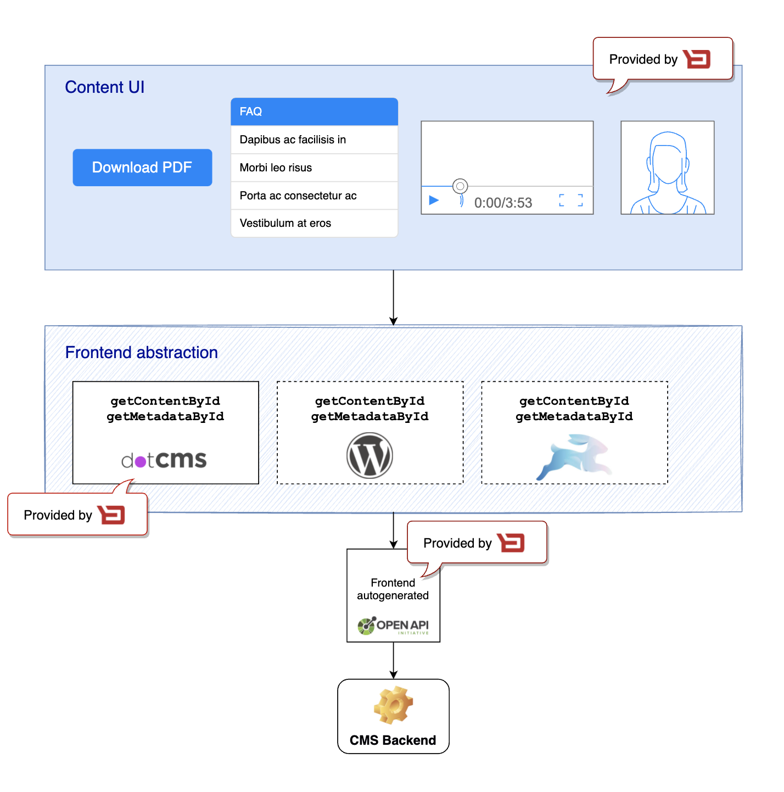

# Understand journey content
On this document you will find how to replace journey content dynamically on your web app.

## Facts 

1. Journey provided functionality is blackboxed.
3. Journey exposes configuration that can be used to change the way journey works by design.
2. Journey views can be replaced by customers when customers decide that a view requires some changes that cannot be handled by configuration.
4. Journey team decides what content is candidate to be modified from outside the journey.
    
## How journey content can be modified
Different methods on which a journey team can allow change content from outside the journey:
1. Journey configuration. 
2. i18n directive and xlif files
    * Backbase banking apps provide its own translated values.
    * Customer can change the values on xlif files to overwrite the one provided by Backbase.
3. Content that can be changed on a CMS and consumed it on the Angular application. 

Besides prev three options, the customer can decide to replace a view and it's content when needed.

From these different methods there are only two of them than require to release a new application:
* i18n directive and xlif files.
* Replacing a view.

## Backbase approach
The Backbase approach on this requires to:
1. Default content must be provided so there is something to render in case content cannot be accessed remotely.
2. If content can be accessed remotely the default content is replaced.

## Backbase CMS recommended:
Backbase recommended CMS is [Wordpress](https://wordpress.com/)

## Architecture 

### Diagram


### Using CMS
As you could see on the diagram the architecture is based on a CMS Backend based on Wordpress.

If you decided not using Wordpress you must provide an adapter to work as Wordpress.

On this example we have provided a Node.js Express server that will work as this adapter.

#### Prepare Wordpress adapter for Drupal
The following steps will start a Express server that will proxy the calls to Drupal and return a valid json as the one provided by Wordpress.

*Pre-requisites*
* Drupal installation [See more](../drupal-install/Readme.md)

_Not all items in Wordpress can be available_

* Change directory to *dp2wp-proxy*
* Execute `npm install` to install dependencies
* Execute `npm run prebuild` to execute linting
* Execute `npm run build` to transpile TypeScript to Javascript
* Execute `npm start` to execute server

Express server runs on `localhost:3000` and we assume Drupal server runs on `http://localhost:9000`


|                 Original Call                 |                 Proxied to                  |
| --------------------------------------------- | ------------------------------------------- | 
|`http://localhost:3000/wp-json/wp/v2/posts/1`  | `http://localhost:9000/node/1?_format=json` |
|`http://localhost:3000/wp-json/wp/v2/media/2`  | `http://localhost:9000/node/2?_format=json` |

#### How my app can connect to Wordpress adapter for Drupal
Drupal and Wordpress responses are incompatible as they don't follow any standards, in order to make it more consistent we have created a response adapter returning the most common used on templates.

When the response is *media* type:
```json
{
    "id": 2,
    "title": {
        "rendered": "Image Title"
    },
    "source_url": "http://localhost:9000/sites/default/files/2021-09/image.jpeg",
    "media_details": {
        "width": 950,
        "height": 633
    },
    "alt_text": "alternative-text"
}
```

When the response is *post* type:
```json
{
    "id": 1,
    "title": {
        "rendered": "Title"
    },
    "content": {
        "rendered": "<p>Content</p> "
    }
}
```


